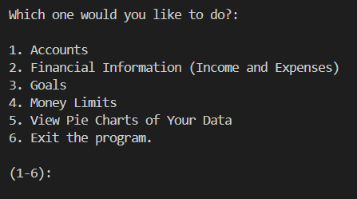

# Financial-Calculator

## project description
---
This project is a financial calculator. Its purpose is to help a user by giving it information about their goals, limits, and their money history. It can
track the history of incomes and expenses, set limits for spending, set goals for saving, display graphs for your money, have accounts so different people
can use it, etc.

## Installation
---
Not used for this class  

## Executian and useage
---
All you have to do to use it is follow the instructions provided on the screen.
  

## Used technologies
---
+ matplotlib
`pip install matplotlib`  

## Current features
---
+ The first feature that I am proud of is the money tracking. I like it because it can display certain time periods.
+ The second feature that I am proud of is the graph display. It displays a neat little graph that provides visuals for the user.
+ The second feature that I am proud of is the limits and goals. It helps the user manage their money well.

## Contributions
---
Not used for this class

## Contributors
---
None

## Authors information
---
Connor Pavicic: Connor loves programming and loves creating stuff for users to enjoy. He always does his best in his
concurrent enrollment computer science class.
Locklin Sheldon: Locklin loves programming and loves creating stuff for users to enjoy. He always does his best in his
concurrent enrollment computer science class.
Lizzy Saldana: Lizzy loves programming and loves creating stuff for users to enjoy. She always does her best in her
concurrent enrollment computer science class.
Eli Robison: Eli loves programming and loves creating stuff for users to enjoy. He always does his best in his
concurrent enrollment computer science class.

## Change Log
---
not used for this class

## License
---
not used for this class

